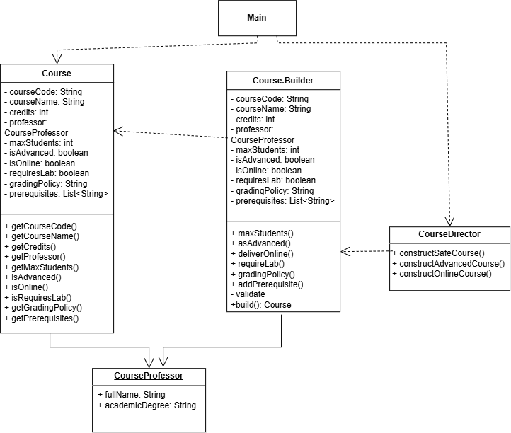

# Assignment 1 - Builder Pattern: Design Under Changing Requirements

## Project overview

This project shows how the Builder Design Pattern can be used to create Course objects in a university system. Instead of using long and confusing constructors, the project uses a simple and readable builder. It also includes validation rules, clean code practices, and tests to make sure the course objects are created correctly.

## Individual Variant Details

Domain:University course

Constraint: Advanced courses must have at least 5 credits and must have at least one prerequisite.

Preset:SAFE

## Validation Rules

1.**Single-field rules**:

`courseCode` must not be null or blank

`credits ` must be greater than 0
 
`professor` must be assigned

2.**Cross-field rules**:

**Advanced Course rule**s: Advanced course must have 5 or more credits and must have at least one prerequisites

**Online Course rule**: If course is online, requiresLab must be false.

## How to run the project?

### Prerequisites

Java Development Kit

Maven or IDE

### Run Main Application

Execute `Main.java` in the location `src/university/Main.java`

### Run automated test

Execute `CourseBuilderTest.java` in the location `test/university/CourseBuilderTest.java`

## Automated Testing Summary

The `CourseBuilderTest.java` file contains 10 tests that check the main parts of the project:

Valid Construction (3 tests): Checks that basic, advanced, and online courses are created correctly.

Invalid Construction (3 tests): Checks that errors are thrown for an empty course code, too few credits for an advanced course, and missing prerequisites.

Boundary Cases (2 tests): Checks that zero or negative credits are rejected and that 5 credits are accepted for an advanced course.

Individual Constraint (1 test): Checks that an online course cannot require a physical lab.

Builder Reuse (1 test): Checks that changing the builder after build() does not affect courses that were already created.

## UML Diagram

